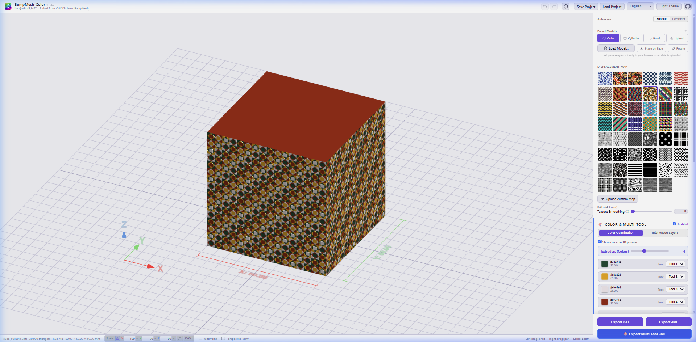
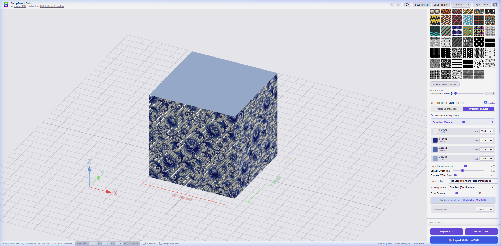
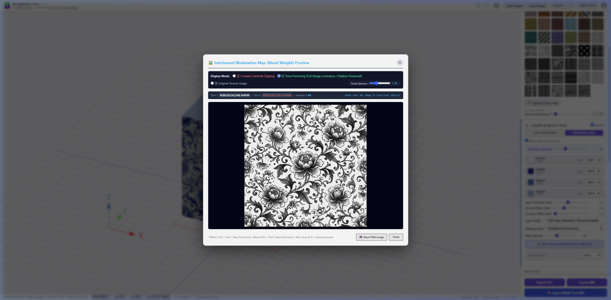
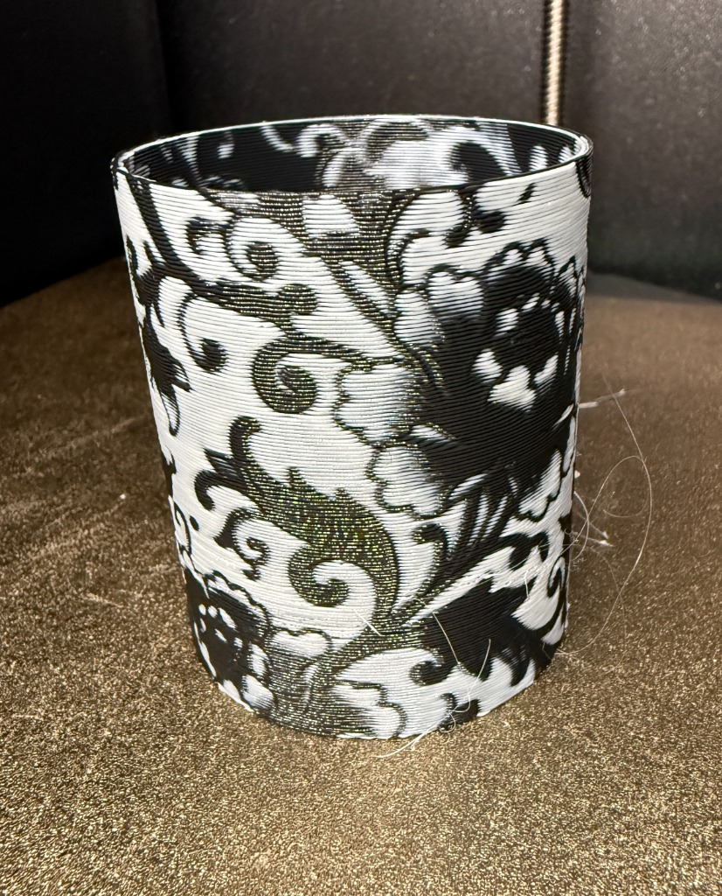
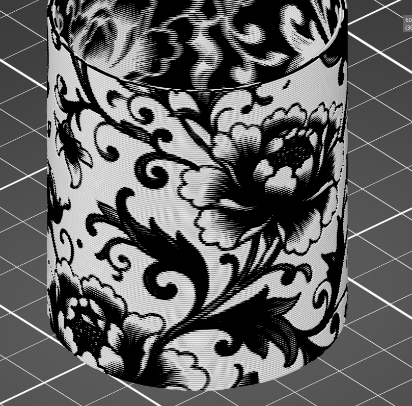
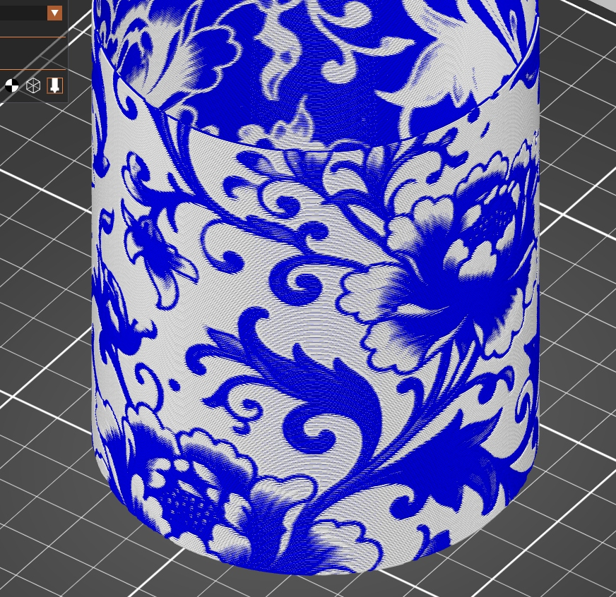
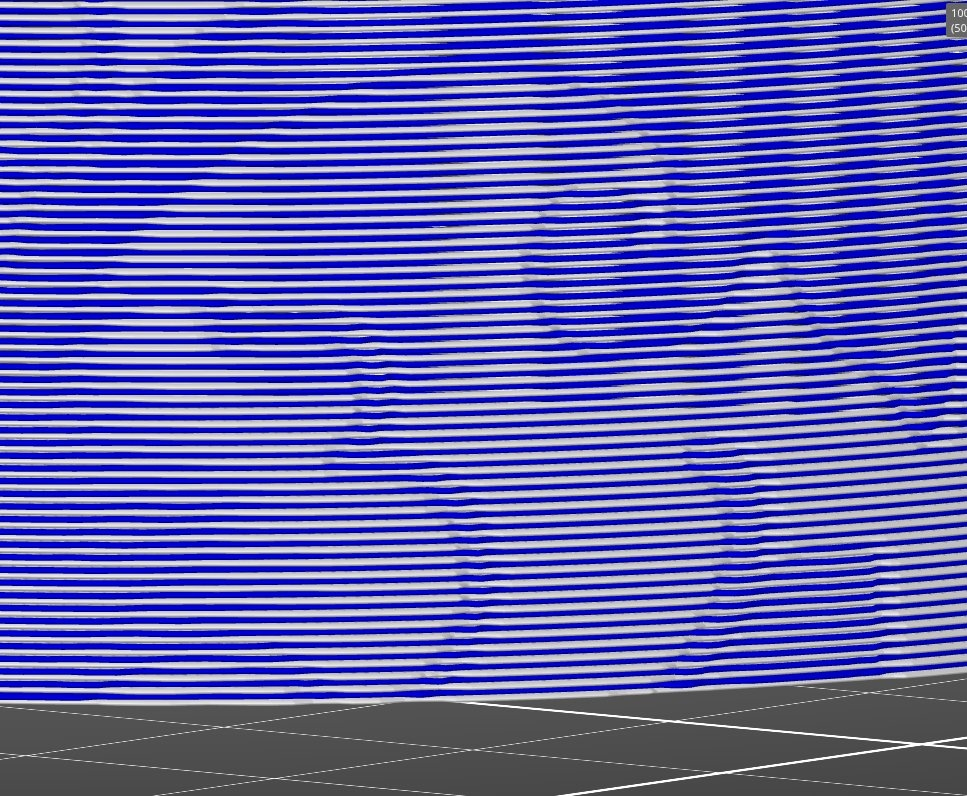

# BumpMesh_Color

[](CHANGELOG.md)
[](LICENSE)

> 🚀 **Live Web App:** **https://mithril-3d.github.io/BumpMesh_Color/**  
> *(No installation required — runs 100% locally in your browser)*  
> 📜 *See [CHANGELOG.md](./CHANGELOG.md) for full version history.*

**Author:** [@Mithril_MEX](https://x.com/Mithril_MEX)  
**Web App:** https://mithril-3d.github.io/BumpMesh_Color/  
**GitHub:** https://github.com/Mithril-3d/BumpMesh_Color  
**Forked from:** [BumpMesh (stlTexturizer)](https://github.com/CNCKitchen/stlTexturizer) by Stefan Hermann ([CNC Kitchen](https://bumpmesh.com))  

> [!IMPORTANT]
> **Disclaimer & Support Notice:**  
> **BumpMesh_Color** is an independent community fork and feature extension created by [@Mithril_MEX](https://x.com/Mithril_MEX).  
> **CNC Kitchen (Stefan Hermann) is NOT affiliated with, does NOT maintain, and does NOT provide support for this modified fork.**  
> Please do NOT contact CNC Kitchen regarding any bugs, print issues, or feature requests related to BumpMesh_Color. All issues, feedback, and inquiries should be directed to [@Mithril_MEX](https://x.com/Mithril_MEX) or submitted via [GitHub Issues](https://github.com/Mithril-3d/BumpMesh_Color/issues).

---

A browser-based tool for applying surface displacement textures and **multi-color / multi-tool 3D printing assignments** to meshes — running entirely client-side with no installation required.

Load an STL, OBJ, 3MF, or STEP file, choose a color or displacement texture, tune procedural parameters, slice into alternating tool layers, and export a slicer-ready multi-color 3MF compatible with **PrusaSlicer, OrcaSlicer, and Bambu Studio**.



---

## 🌟 What's New in Recent Updates

- **v1.2.0 (Latest Release - 2026-09-22)**:
  - **Interleaved Layer Gradient Shading with Full-Range Luminance & Gamma Control**:
    - Eliminated dark shadow clipping and flattening. Uses ITU-R BT.709 full-range luminance and continuous gamma control (`0.40`–`2.20`, default `1.00`) for rich, smooth tone transitions from deep shadows to highlights.
    - Complete calculation parity across the 3D viewport shader, multi-tool 3MF export geometry, and 2D modulation map preview.
  - **2D Interleaved Modulation Map Preview Modal**:
    - Inspect the exact slice blend-weight map directly in the browser before export.
    - Features 3 display modes (Centroid Clipping, Tone-Preserving Full-Range, Original Texture), an interactive real-time pixel inspector, live gamma tuning, and PNG image download.
  - **Streamlined COLOR & MULTI-TOOL UI**:
    - Extruder count slider highlighted at the very top of the panel.
    - Color palette list unified across both Color Quantization and Interleaved Layers tabs for seamless configuration.
    - Dedicated bold button for one-click access to the 2D modulation map modal.
  - **Pixel-Perfect Alignment & Dynamic i18n Cache-Busting**:
    - Auto-save switch margins aligned with lower section headers; fixed dynamic translation asset caching.
- **v1.1.4 (2026-09-21)**:
  - **Full Project Save & Load (`.bumpmesh`)**: Save and restore the 3D mesh, texture image, procedural settings, and color palette into a single portable project file.
  - **Auto-Save Mode Switching**: Instant toggle between Session (`sessionStorage`) and Persistent (`localStorage`) auto-save modes.
  - **Privacy & Imprint Modal**: Full disclosure of 100% client-side, zero-telemetry architecture.
- **v1.1.3 & v1.1.2 (2026-09-20)**:
  - **Persistent Tool Assignments**: Retains custom extruder tool assignments (Tool 1–8) even when switching or reloading textures.
  - **Interactive Real-Time Model Scaling**: Scale models by percentage (X/Y/Z) with uniform aspect ratio lock (🔒) and camera fit.

---

## 🌟 Key Features Added in BumpMesh_Color

### 1. 🎨 Color Quantization & Multi-Tool Mapping
- **Automatic Dominant Color Extraction**: Uses K-means color quantization on texture images to extract representative palettes (2 to 8 extruders/tools).
- **Tool Assignment**: Flexibly assign each quantized color to specific physical extruders/tools (Tool 1 to Tool 8).
- **Untextured Area Tool**: Dedicate a specific extruder/tool for bottom surfaces, untextured sides, or masked areas.
- **3D Color Preview**: Real-time GPU viewport rendering of the quantized tool assignments across model surfaces.

### 2. 🔄 Interleaved Layer Slicing (交互積層マルチツール振り重ね)
- **Layer-by-Layer Tool Alternation**: Slices texture depth into alternating layers based on slicer layer height (0.08 mm – 0.40 mm).
- **Convex & Concave Displacement**:
  - Layers matching the target color extrude outward (Convex offset).
  - Layers of other colors recess inward (Concave offset).
- **Profile Modes**:
  - **Flat Step (Standard / Recommended)**: Produces crisp, perpendicular step edges between color bands.
  - **45° Louver Overhang (Experimental)**: Angled overhangs that shield non-target layers from direct top-down view.
- **Tonal Shading & Gamma Tuning**:
  - **Sharp (Binary / 0-1)**: Solid, distinct color levels.
  - **Gradient (Continuous)**: Smoothly modulates extrusion depth based on full-range luminance (ITU-R BT.709) without shadow clipping.
  - **Tonal Gamma Control (`0.40`–`2.20`)**: Fine-tune shadow contrast and midtone balance in real time.
- **2D Modulation Map Inspector Modal**:
  - Click **"🖼️ View Interleaved Modulation Map (2D)"** to examine the exact grayscale weight map used for layer thickness modulation.
  - Compare algorithms side-by-side (Centroid Clipping vs. Tone-Preserving Full-Range) and hover over any pixel to inspect RGB, luminance, and blend weights.


*Fig. 1: Updated Interleaved Layers configuration panel with Extruder Count, palette mapping, and real-time 3D preview.*


*Fig. 2: 2D Interleaved Modulation Map Inspector modal with live gamma tuning and pixel inspection.*

| Actual Printed Result (White & Black Filament) | Sliced Preview (Infill 0%, Perimeters 2) |
| :---: | :---: |
|  |  |

| Slicer Result (Infill 0%, Top 0, Perimeters 1) | Alternating Layer Detail (Close-up) |
| :---: | :---: |
|  |  |

> [!TIP]
> **Recommended Slicer Print Settings for Interleaved Layers (振り重ね):**  
> - **Infill:** 0%  
> - **Top solid layers:** 0  
> - **Perimeters (Walls):** 1 or 2 *(depending on wall thickness; 2 perimeters works great for hollow cylinders and cups)*  
> - **Ensure vertical shell thickness:** Disabled (Off)
>
> 📖 **Deep Dive Article:** For a detailed breakdown of the background, theory, and printing mechanics behind the "振り重ね" (Interleaved Layer) technique, see the author's article:  
> [振り重ねプリント手法の解説 (note.com)](https://note.com/mithril_mex/n/nf6866893448c)

### 3. 📦 Seamless Multi-Tool 3MF Export
- **Full Slicer Compatibility**: Generates standard 3MF archives with multi-part objects directly recognized by **PrusaSlicer**, **OrcaSlicer**, and **Bambu Studio** without configuration hassles.
- **Windows Explorer Thumbnail**: Automatically embeds compliant PNG thumbnails so files display high-res preview icons in Windows File Explorer.
- **Non-blocking Progress**: Asynchronous export pipeline with realistic 0%–100% progress reporting that never freezes the browser.

### 4. 💾 Full Project Save & Auto-Save (.bumpmesh)
- **All-in-One Portable Archives**: Save loaded 3D models, textures, parameter adjustments, and multi-color tool assignments in a single `.bumpmesh` project file.
- **Auto-Save Switch**: Choose between **Session** (`sessionStorage`) and **Persistent** (`localStorage`) modes directly from the header.
- **Tool Memory Retention**: Custom tool mappings (e.g. Tool 7, Tool 8) persist across texture replacements.

### 5. 📐 Interactive Real-Time Model Scaling
- **Live Percent Scaling**: Resize X / Y / Z with instantaneous viewport rendering and bounding box millimeter updates.
- **Uniform Aspect Ratio Lock (🔒)**: Lock proportions or unlock for anisotropic scaling.
- **1-Click Reset & Fit**: One-click 100% restore and camera frame fitting (⛶).

### 6. 🌐 Comprehensive 14-Language Localization
Fully localized UI with instant language switching:
- English, Japanese (日本語), German (Deutsch), French (Français), Spanish (Español), Italian (Italiano), Portuguese (Português), Chinese (中文), Korean (한국어), Russian (Русский), Ukrainian (Українська), Polish (Polski), Danish (Dansk), Turkish (Türkçe).

---

## 🛠️ Core BumpMesh Features

- **Projection Modes**: Triplanar (default normal blending), Cubic (Box), Cylindrical, Spherical, Planar (XY, XZ, YZ).
- **UV Transform**: Logarithmic Scale U/V, Offset U/V, Rotation, and Seam Blending.
- **Masking Tools**:
  - Angle-based masking (suppress texture on top/bottom faces).
  - Interactive face painting (brush tool and dihedral bucket fill).
  - Smooth transition curves (linear, S-curve, ease-in).
- **File Format Support**:
  - Input: `.stl`, `.obj`, `.3mf`, `.step` / `.stp` (via client-side B-rep tessellation).
  - Output: Binary `.stl`, Standard `.3mf`, Multi-Tool `.3mf`.
- **Privacy First**: 100% client-side WebAssembly and WebGL execution. No 3D files or textures are ever uploaded to any server.

---

## 🚀 Getting Started

### Slicer Workflow (Multi-Color Printing)

1. Open **BumpMesh_Color** in your browser.
2. Drag and drop your 3D model (`.stl`, `.obj`, `.step`, or `.3mf`).
3. Select a color texture preset from the sidebar (or upload your own image).
4. Under **Color & Multi-Tool**, configure:
   - **Extruder Count**: Set the number of colors/tools to extract.
   - **Tool Assignments**: Assign Tool 1..N to your printer's toolheads or AMS/MMU slots.
   - **Mode**: Choose between *Color Quantization* or *Interleaved Layers*.
5. Click **🎨 Export Multi-Tool 3MF**.
6. Drag the downloaded `.3mf` file directly into **PrusaSlicer**, **OrcaSlicer**, or **Bambu Studio**. Select **"Load as a single object with multiple parts"** when prompted.
7. Slice and print!

---

## 💻 Running Locally

The easiest way to use BumpMesh_Color is via the **[Live Web App](https://mithril-3d.github.io/BumpMesh_Color/)** (100% client-side, no data uploaded).

If you prefer to run it locally, modern browsers require a local static HTTP server for ES modules and local texture access:

```bash
# 1. Clone the repository
git clone https://github.com/Mithril-3d/BumpMesh_Color.git
cd BumpMesh_Color

# 2. Start the local server
python -m http.server 8080
```

Then open `http://localhost:8080` in your browser. All processing still runs 100% locally and offline on your computer.

---

## 📜 License & Credits

- **Original Project:** [BumpMesh (stlTexturizer)](https://github.com/CNCKitchen/stlTexturizer) by Stefan Hermann ([CNC Kitchen](https://bumpmesh.com)).
- **Fork Modifications:** [@Mithril_MEX](https://x.com/Mithril_MEX).
- **License:** Licensed under the [GNU Affero General Public License v3.0 (AGPL-3.0)](LICENSE).

---

# 日本語ドキュメント (Japanese)

[](CHANGELOG.md)
[](LICENSE)

> 🚀 **ブラウザで今すぐ使う (Web App):** **https://mithril-3d.github.io/BumpMesh_Color/**  
> *(インストール不要・完全ローカル処理で安心)*  
> 📜 *詳細な更新履歴は [CHANGELOG.md](./CHANGELOG.md) をご覧ください。*

**作者:** [@Mithril_MEX](https://x.com/Mithril_MEX)  
**公開URL (Web App):** https://mithril-3d.github.io/BumpMesh_Color/  
**GitHub:** https://github.com/Mithril-3d/BumpMesh_Color  
**元プロジェクト:** Stefan Hermann 氏 ([CNC Kitchen](https://bumpmesh.com)) による [BumpMesh (stlTexturizer)](https://github.com/CNCKitchen/stlTexturizer)  

> [!IMPORTANT]
> **免責事項・サポートについて:**  
> **BumpMesh_Color** は、[@Mithril_MEX](https://x.com/Mithril_MEX) が開発した非公式の拡張フォークプロジェクトです。  
> **元作者の CNC Kitchen (Stefan Hermann 氏) は、本フォークの開発・保守・サポートには一切関与していません。**  
> 不具合の報告、質問、機能要望などを CNC Kitchen 側へ問い合わせることは絶対に避けてください。すべての問い合わせやフィードバックは、[@Mithril_MEX](https://x.com/Mithril_MEX) または本リポジトリの [GitHub Issues](https://github.com/Mithril-3d/BumpMesh_Color/issues) までお願いいたします。

---

**BumpMesh_Color** は、3Dメッシュの表面にテクスチャ画像を貼り付けて凹凸（ディスプレイスメント）を形成し、さらに**マルチカラー・マルチツール3Dプリント用のパーツ分割・スライス割り当て**をブラウザ上だけで完結できるWebツールです。インストール不要で、すべての処理はお使いのPCのブラウザ内（ローカル）で安全に動作します。

STL、OBJ、3MF、STEPファイルを読み込み、カラー画像テクスチャや和柄を選択し、各パラメータを調整するだけで、**PrusaSlicer、OrcaSlicer、Bambu Studio** に完全対応したマルチツール3MFファイルを直接出力できます。


---

## 🌟 最近の主な更新ハイライト (Recent Updates)

- **v1.2.0 (最新安定版 - 2026-09-22)**:
  - **振り重ねグラデーション階調保持（フルレンジ輝度＆ガンマ補正）**:
    - 従来の暗部（影や髪の毛など）の黒潰れ・平坦化を解消。ITU-R BT.709フルレンジ輝度とガンマ補正（`0.40`〜`2.20`、標準 `1.00`）により、暗部から明部まで豊かな連続階調表現を実現。
    - 3Dビューポートのプレビューシェーダー、マルチツール3MFエクスポート、2D変調プレビューで同一の計算式を適用し、完全一致を保証。
  - **振り重ね変調画像（2Dマップ）確認プレビューモーダル新設**:
    - スライス・エクスポート前に、実際に層ごとの厚み変調に使われる重みマップ画像を画面上で直接確認できるモーダルを新設。
    - 3つの表示モード（重心クリッピング旧方式、フルレンジ階調保持、元テクスチャ画像）、インタラクティブインスペクター（ピクセル情報表示）、ライブガンマ調整、PNG画像保存に対応。
  - **COLOR & MULTI-TOOL パネルのUI配置最適化**:
    - 最重要パラメータである Extruder 数スライダーを最上部に際立たせ、カラーパレット一覧を共通化。操作性を大幅に向上。
  - **UI細部調和・多言語辞書のキャッシュバスティング対応**:
    - 自動保存スイッチの余白垂直統一、および言語切り替え時のブラウザキャッシュによるキー名表示不具合を解消。
- **v1.1.4 (2026-09-21)**:
  - **プロジェクト保存・読込（`.bumpmesh`）の完全対応**: メッシュ、画像、パラメータ、パレットを丸ごと保存・復元。
  - **自動保存モード切替**: 短期保存（`sessionStorage`）と長期保存（`localStorage`）をワンクリック切替。
  - **プライバシーポリシー明記**: 完全ローカル実行・Cookie不使用・通信ゼロの安全性を明文化。
- **v1.1.3 & v1.1.2 (2026-09-20)**:
  - **ツール番号の短期記憶保持**: テクスチャを変更・再読込しても設定したツール番号（Tool 1〜8）をセッション中に維持。
  - **リアルタイムモデル拡大縮小（スケーリング）**: パーセント即時入力、縦横比固定ロック（🔒）、カメラフィット。

---

## 🌟 BumpMesh_Color の主な新機能

### 1. 🎨 カラー量子化とマルチツール割り当て
- **代表色の自動抽出**: テクスチャ画像からK-meansアルゴリズムで主要色（2〜8色 / Extruder数）を自動抽出し、カラーパレットを生成します。
- **物理ツールへの柔軟なマッピング**: 抽出された各色を、3Dプリンターの各エクストルーダーやAMS/MMUのスロット（Tool 1〜8）に自由に割り当てられます。
- **非テクスチャ部ツール設定**: モデル底面やマスク指定した「テクスチャを適用しない領域」に割り当てる専用ツールを個別に指定可能です。
- **3Dカラーリアルタイムプレビュー**: 割り当てたツールごとの色分けをビューポート上で立体的に確認できます。

### 2. 🔄 交互積層マルチツール方式 (振り重ねインターリーブ積層)
- **レイヤー単位のツール交互積層**: テクスチャの深さ方向を、スライサーの積層ピッチ（0.08mm〜0.40mm）単位で各ツールの層として交互に積み重ねます。
- **凸量（突出）と凹量（引込）の個別制御**:
  - 目的色と一致する層は外側に突出（凸量オフセット）。
  - 目的色と一致しない他色の層は内側に引込（凹量オフセット）。
- **断面プロファイル選択**:
  - **フラット段差（標準ステップ・推奨）**: 色の境界が直角で美しい、くっきりとした標準仕上げ。
  - **45° ルーバー庇（実験的）**: 上からの視線に対して他色層を隠す庇（ひさし）形状。
- **階調表現とガンマ調整**:
  - **シャープ（二値 / 0-1）**: はっきりとしたコントラストの二値表現。
  - **グラデーション（連続階調）**: フルレンジ輝度（ITU-R BT.709）により暗部クリッピングなしで滑らかに変調。
  - **階調調整 (ガンマ) スライダー（`0.40`〜`2.20`）**: 暗部の引き締めや明暗バランスをリアルタイム調整。
- **振り重ね変調画像（2Dマップ）確認プレビューモーダル**:
  - **「🖼️ 振り重ね変調画像（2Dマップ）を確認」** ボタンから、実際にスライス変調に用いられるモノクロ重みマップを全画面モーダルで検査可能。
  - 表示モード切替やピクセルごとのRGB・輝度・ブレンド重みのリアルタイムインスペクター、PNG画像保存を搭載。


*図1: 最新の振り重ね設定パネル（最上部Extruder数、共通パレット、3Dプレビュー連動）*


*図2: 2D変調画像インスペクターモーダル（表示モード切替・リアルタイムガンマ調整・ピクセル情報インスペクター）*

| 実際のプリント出力例 (白・黒 2色フィラメント) | スライサーでのスライス結果 (インフィル0%, ペリメータ2) |
| :---: | :---: |
|  |  |

| スライサーでのスライス結果 (インフィル0%, トップ層0, ペリメータ1) | 振り重ね積層断面の拡大 (交互積層ディテール) |
| :---: | :---: |
|  |  |

> [!TIP]
> **振り重ね（交互積層）出力時のスライサー推奨設定:**  
> - **インフィル (Infill):** 0%  
> - **トップ層 (Top solid layers):** 0  
> - **ペリメータ (Perimeters / 外周壁ループ数):** 1 または 2 *(肉厚やモデル形状に応じて調整。円筒やカップ等の薄肉モデルではペリメータ2でも美しく出力可能)*  
> - **垂直シェルの厚みを確保する (Ensure vertical shell thickness):** **無効 (Off)**
>
> 📖 **詳細解説記事 (note):** 振り重ねプリント手法の着想・原理・スライスノウハウについての詳しい解説は、以下のnote記事をご参照ください：  
> [振り重ねプリント手法の解説｜note (@Mithril_MEX)](https://note.com/mithril_mex/n/nf6866893448c)

### 3. 📦 スライサー完全互換のマルチツール 3MF エクスポート
- **ドラッグ＆ドロップで即座に認識**: 出力された3MFファイルを **PrusaSlicer**、**OrcaSlicer**、**Bambu Studio** にドラッグ＆ドロップするだけで、ツール番号ごとのマルチパーツ（オブジェクト）として自動認識されます。
- **Windows エクスプローラーのサムネイル表示**: 標準的な3MFサムネイル仕様に準拠しており、Windowsのエクスプローラー上で高解像度プレビューアイコンが表示されます。
- **フリーズしない非同期進捗バー**: 大規模なメッシュでもブラウザが固まらず、0%〜100%の進捗がスムーズに表示されます。

### 4. 💾 プロジェクト保存・復元 & 自動保存 (.bumpmesh)
- **オールインワンのプロジェクト保存**: 読み込んだ3Dモデル、テクスチャ画像、調整パラメータ、マルチカラーのツール割り当てをすべて1つの `.bumpmesh` ファイル（ZIP形式）として保存・復元可能。
- **自動保存モード切替**: ヘッダーから短期保存（`sessionStorage`）と長期保存（`localStorage`）をワンクリックで切り替え可能。
- **ツール番号設定の記憶保持**: テクスチャを別の画像に差し替えても、ユーザーが設定した各色のツール番号（Tool 1〜8）をセッション中に自動保持。

### 5. 📐 リアルタイムモデル拡大縮小（スケーリング）
- **パーセント即時入力**: X / Y / Z の%数値を入力すると即座に3Dビューポートと寸法線に反映。
- **縦横比固定ロック（🔒）**: ロック時はプロポーションを維持したまま一括スケーリング。解除で各軸個別変倍に対応。
- **1クリック復元＆カメラフィット**: 100%リセットや、モデル全体を収めるカメラフィット（⛶）に対応。

### 6. 🌐 14言語の完全ローカライズ
日本語および英語をはじめ、ドイツ語、フランス語、スペイン語、イタリア語、ポルトガル語、中国語、韓国語、ロシア語、ウクライナ語、ポーランド語、デンマーク語、トルコ語の計14言語に完全対応。右上の言語セレクターからいつでも即座に切り替え可能です。

---

## 🛠️ BumpMesh の基本機能

- **投影モード**: トライプラナー（法線ブレンド・標準）、キュービック（ボックス）、シリンドリカル（円筒）、スフェリカル（球状）、プラナー（XY/XZ/YZ平面）。
- **UV・変形調整**: スケールU/V（対数スライダー・縦横連動）、オフセットU/V、回転、シーム境界ブレンド。
- **マスキング機能**:
  - 角度マスク（底面や上面の平坦部へのテクスチャ除外）
  - サーフェスペイント（ブラシツールおよび角度指定のバケツ塗りつぶし）
  - 滑らかな境界フォールオフ（リニア、S字カーブ、イーズイン）
- **対応ファイル形式**:
  - 読み込み: `.stl`, `.obj`, `.3mf`, `.step` / `.stp` (ブラウザ内B-repメッシュ化)
  - 書き出し: バイナリ `.stl`, 標準 `.3mf`, マルチツール `.3mf`
- **プライバシー保護**: 100% クライアント側（ブラウザ内）処理。3Dモデルや画像データが外部サーバーに送信されることは一切ありません。

---

## 🚀 使い方とスライサー連携の流れ

1. ブラウザで **BumpMesh_Color** を開きます。
2. 3Dモデルファイル（`.stl`, `.obj`, `.step`, `.3mf`）を画面にドラッグ＆ドロップします。
3. サイドバーからお好みのカラーテクスチャを選択します（または「Upload custom map」からお手持ちの画像をアップロード）。
4. **Color & Multi-Tool** セクションで設定を行います：
   - **Extruder数**: 抽出する色数（ツール数）を指定。
   - **ツール割り当て**: 各色を3Dプリンターの各ツールやAMS/MMUのスロット番号に割り当て。
   - **モード**: 「カラー量子化」または「交互積層 (振り重ね)」を選択。
5. 画面右下の **🎨 Export Multi-Tool 3MF** をクリックしてダウンロードします。
6. ダウンロードした `.3mf` ファイルを **PrusaSlicer**、**OrcaSlicer**、または **Bambu Studio** にドラッグ＆ドロップします（「複数パーツを持つ単一オブジェクトとしてロードしますか？」と表示されたら「はい」を選択）。
7. スライスして印刷します！

---

## 💻 ローカル環境での実行方法

最も手軽な方法は **[Web App 版](https://mithril-3d.github.io/BumpMesh_Color/)** をそのままブラウザで開くことです（完全ブラウザ内処理のため、外部へのデータ送信はありません）。

ローカルPC上で直接実行する場合は、モダンブラウザのセキュリティ制限（`file://` URL からのESモジュール読み込み制限）を避けるため、ローカルHTTPサーバーを起動します：

```bash
# 1. リポジトリをクローン
git clone https://github.com/Mithril-3d/BumpMesh_Color.git
cd BumpMesh_Color

# 2. ローカルサーバーを起動
python -m http.server 8080
```

ブラウザで `http://localhost:8080` を開きます。処理自体はすべてPC内で完結し、完全オフラインで動作します。
