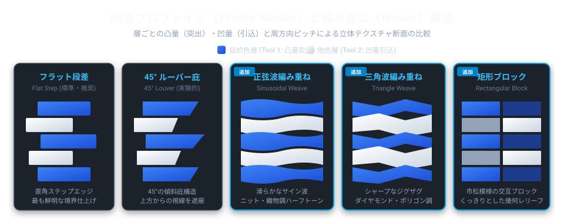
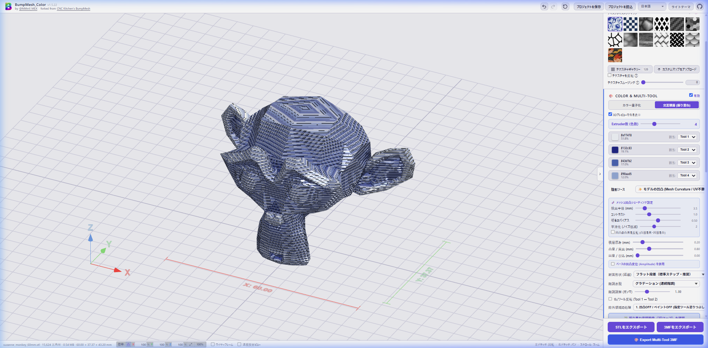
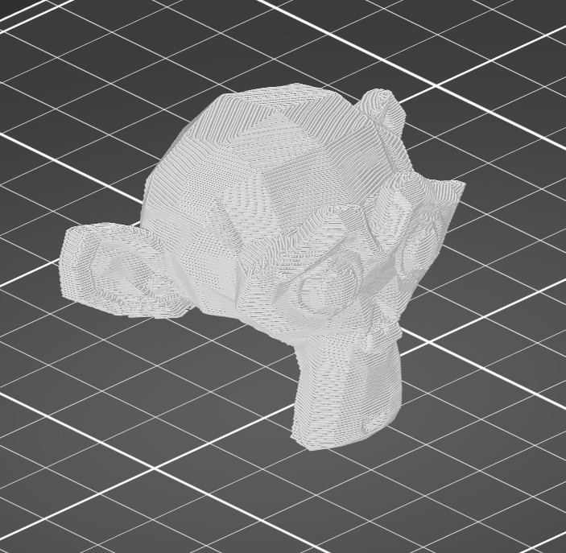
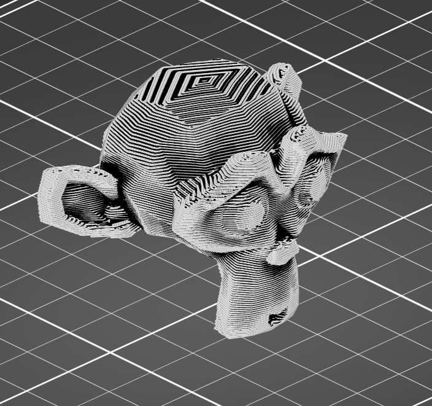
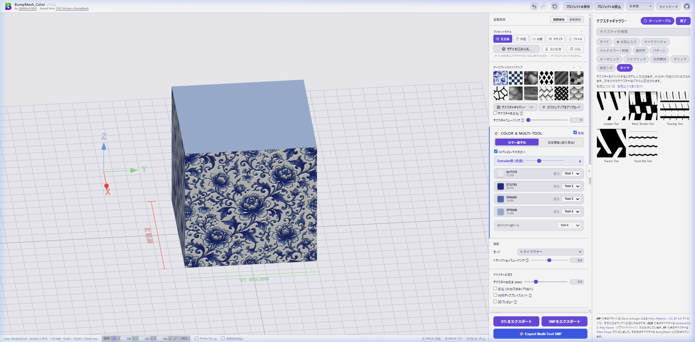

# BumpMesh_Color

[](CHANGELOG.md)
[](LICENSE)

> 🚀 **Live Web App:** **https://mithril-3d.github.io/BumpMesh_Color/**  
> *(No installation required — runs 100% locally in your browser)*  
> 📜 *See [CHANGELOG.md](./CHANGELOG.md) for full version history.*

**Author:** [@Mithril_MEX](https://x.com/Mithril_MEX)  
**Web App:** https://mithril-3d.github.io/BumpMesh_Color/  
**GitHub:** https://github.com/Mithril-3d/BumpMesh_Color  
**Forked from:** [BumpMesh (stlTexturizer)](https://github.com/CNCKitchen/stlTexturizer) by Stefan Hermann ([CNC Kitchen](https://bumpmesh.com))  

> [!IMPORTANT]
> **Disclaimer & Support Notice:**  
> **BumpMesh_Color** is an independent community fork and feature extension created by [@Mithril_MEX](https://x.com/Mithril_MEX).  
> **CNC Kitchen (Stefan Hermann) is NOT affiliated with, does NOT maintain, and does NOT provide support for this modified fork.**  
> Please do NOT contact CNC Kitchen regarding any bugs, print issues, or feature requests related to BumpMesh_Color. All issues, feedback, and inquiries should be directed to [@Mithril_MEX](https://x.com/Mithril_MEX) or submitted via [GitHub Issues](https://github.com/Mithril-3d/BumpMesh_Color/issues).

---

A browser-based tool for applying surface displacement textures and **multi-color / multi-tool 3D printing assignments** to meshes — running entirely client-side with no installation required.

Load an STL, OBJ, 3MF, or STEP file, choose a color or displacement texture, tune procedural parameters, slice into alternating tool layers, and export a slicer-ready multi-color 3MF compatible with **PrusaSlicer, OrcaSlicer, and Bambu Studio**.


---

## 🌟 Key Features Added in BumpMesh_Color

### 1. 🎨 Color Quantization & Multi-Tool Mapping
- **Automatic Dominant Color Extraction**: Uses K-means color quantization on texture images to extract representative palettes (2 to 8 extruders/tools).
- **Tool Assignment**: Flexibly assign each quantized color to specific physical extruders/tools (Tool 1 to Tool 8).
- **Untextured Area Tool**: Dedicate a specific extruder/tool for bottom surfaces, untextured sides, or masked areas.
- **3D Color Preview**: Real-time GPU viewport rendering of the quantized tool assignments across model surfaces.

### 2. 🔄 Interleaved Layer Slicing & Weave Modes (交互積層・編み重ね)
- **Layer-by-Layer Tool Alternation**: Slices texture depth into alternating layers based on slicer layer height (0.08 mm – 1.00 mm).
- **Convex & Concave Displacement**:
  - Layers matching the target color extrude outward (Convex offset).
  - Layers of other colors recess inward (Concave offset).

#### 📐 Profile Modes & Weave Additions (断面プロファイルと編み重ね)
In addition to conventional step offsets, BumpMesh_Color features procedural **Profile Modes** that define the cross-sectional geometry between alternating tool layers, including **newly added Weave modes**:



- **Flat Step (Standard / Recommended)**: Crisp, perpendicular step edges between color bands for maximum graphic clarity.
- **45° Louver Overhang (Experimental)**: Angled overhangs that shield non-target layers from direct top-down view.
- **Sinusoidal Weave (正弦波 - Weave Addition)**: Smooth, undulating harmonic wave profile creating fabric-like knitwear textures and soft color halftones.
- **Triangle Weave (三角波 - Weave Addition)**: Sharp, diamond-faceted zig-zag relief with crisp geometric highlights.
- **Rectangular Block Weave (矩形ブロック - Weave Addition)**: Checkerboard alternating interlocking blocks for bold structural patterns.
- **Universal Arbitrary Mesh Weave Engine**: Automatically extracts horizontal contour cross-sections for any 3D model (cylinders, organic sculptures, custom STLs) and synthesizes single-perimeter hollow bands (100% outer perimeter, 0% infill, 0 top/bottom layers) with zero sampling aliasing.

#### 💡 Dual Shading Sources (2系統の陰影ソース選択)
You can drive layer thickness modulation using either 2D texture graphics or the 3D model's own organic relief:


*Curvature-based geometric shading demonstrated on Suzanne (Blender Monkey): High-convexity ridges (brows, nose, ears) and deep crevices automatically modulate extrusion thickness without requiring any 2D texture map.*

| Standard Monolithic Slicing (Single Tool) | Interleaved Geometric Curvature Slicing (Dual Tools) |
| :---: | :---: |
|  |  |
*Slicer comparison: Left shows standard single-color slicing with uniform layer beads. Right demonstrates BumpMesh_Color curvature-driven interleaved slicing—ridges (brows, nose, ears) and deep valleys are automatically extruded and recessed as alternating white/black tool layers to form vivid physical self-shading.*

- **Texture Image**: Derives layer extrusion depth from 2D pixel colors or procedural graphics.
- **Surface Curvature (幾何曲率陰影)**: Computes local mean curvature directly from the 3D triangle mesh. Convex peaks (highlights) extrude while concave valleys (shadows) recess, turning 3D sculptures into tangible self-shading multi-color reliefs without any texture image.


#### 🎛️ Tonal Shading, Gamma & Base Displacement
- **Tonal Shading Options**: Choose between **Sharp** (binary solid color levels) and **Gradient** (continuous ITU-R BT.709 full-range luminance modulation without shadow clipping).
- **Tonal Gamma Control (`0.40`–`2.20`)**: Real-time slider to calibrate midtone contrast and shadow depth.
- **Base Mesh Displacement Bypass Option**: Optional checkbox to preserve underlying macro displacement (`amplitude`) while simultaneously modulating micro interleaved steps.
- **2D Modulation Map Inspector Modal**: Examine the exact grayscale modulation weight map in a full-screen inspector with live RGB and blend weight probes.


*Fig. 1: Interleaved Layers configuration panel with Blue Porcelain gradient, Extruder Count, palette mapping, base displacement toggle, and real-time 3D preview.*


*Fig. 2: 2D Interleaved Modulation Map Inspector modal with Blue Porcelain luminance modulation map, live gamma tuning, and pixel inspection.*

| Actual Printed Result (White & Black Filament) | Sliced Preview (Infill 0%, Perimeters 2) |
| :---: | :---: |
|  |  |

| Slicer Result (Infill 0%, Top 0, Perimeters 1) | Alternating Layer Detail (Close-up) |
| :---: | :---: |
|  |  |

> [!TIP]
> **Recommended Slicer Print Settings for Interleaved Layers (振り重ね):**  
> - **Infill:** 0%  
> - **Top solid layers:** 0  
> - **Perimeters (Walls):** 1 or 2 *(depending on wall thickness; 2 perimeters works great for hollow cylinders and cups)*  
> - **Ensure vertical shell thickness:** Disabled (Off)
>
> 📖 **Deep Dive Article:** For a detailed breakdown of the background, theory, and printing mechanics behind the "振り重ね" (Interleaved Layer) technique, see the author's article:  
> [振り重ねプリント手法の解説 (note.com)](https://note.com/mithril_mex/n/nf6866893448c)

### 3. 🖼️ Texture Gallery & Rich Preset Library
- **125 Built-in Presets**:
  - 12 curated multi-color patterns (Porcelain, Ichimatsu, Tartan, Stained Glass, Honeycomb, etc.).
  - 113 upstream procedural displacement textures organized into 9 categories:
    `Multicolor`, `Geometric`, `Patterns`, `Organic`, `Fabric`, `Natural`, `Grip`, `Molded` (8 mold grains), and `Tires` (5 tire treads).
- **Interactive Browsing & Search**:
  - Instant text filter and category chips.
  - Star pinning (★) to dock frequently used textures to the main sidebar.
  - Turntable mode for 360° dynamic model review.
  - Client-side IndexedDB storage for saving user custom textures locally.


*Fig. 3: Built-in Texture Gallery featuring the newly added Tires and Molded texture categories.*

### 4. 📦 Seamless Multi-Tool 3MF Export
- **Full Slicer Compatibility**: Generates standard 3MF archives with multi-part objects directly recognized by **PrusaSlicer**, **OrcaSlicer**, and **Bambu Studio** without configuration hassles.
- **Rotation & Orientation Preservation**: User-rotated model orientations and Z-grounding are 100% preserved in the exported 3MF.
- **High-Performance Pipeline**: Zero-allocation typed-array spatial hashing and asynchronous chunking ensure export never freezes the browser.
- **Safari & macOS Ready**: Automatic MIME sanitization prevents download corruption across WebKit browsers.
- **Embedded PNG Thumbnails**: Embeds high-resolution, centered thumbnails for seamless display in Windows File Explorer and slicer plate previews.

### 5. 💾 Full Project Save & Auto-Save (.bumpmesh)
- **All-in-One Portable Archives**: Save loaded 3D models, textures, parameter adjustments, and multi-color tool assignments in a single `.bumpmesh` project file.
- **Auto-Save Switch**: Choose between **Session** (`sessionStorage`) and **Persistent** (`localStorage`) modes directly from the header.
- **Tool Memory Retention**: Custom tool mappings persist across texture replacements.

### 6. 📐 Interactive Real-Time Model Scaling
- **Live Percent Scaling**: Resize X / Y / Z with instantaneous viewport rendering and bounding box millimeter updates.
- **Uniform Aspect Ratio Lock (🔒)**: Lock proportions or unlock for anisotropic scaling.
- **1-Click Reset & Fit**: One-click 100% restore and camera frame fitting (⛶).

### 7. 🌐 Comprehensive 16-Language Localization
Fully localized UI with instant language switching:
- English, Japanese (日本語), German (Deutsch), French (Français), Spanish (Español), Italian (Italiano), Portuguese (Português), Chinese (中文), Korean (한국어), Russian (Русский), Ukrainian (Українська), Polish (Polski), Danish (Dansk), Turkish (Türkçe), Finnish (Suomi), Dutch (Nederlands).

---

## 🛠️ Core BumpMesh Features

- **Projection Modes**: Triplanar (default normal blending), Cubic (Box), Cylindrical, Spherical, Planar (XY, XZ, YZ).
- **UV Transform**: Logarithmic Scale U/V, Offset U/V, Rotation, and Seam Blending.
- **Masking Tools**:
  - Angle-based masking (suppress texture on top/bottom faces).
  - Interactive face painting (brush tool and dihedral bucket fill).
  - Smooth transition curves (linear, S-curve, ease-in).
- **File Format Support**:
  - Input: `.stl`, `.obj`, `.3mf`, `.step` / `.stp` (via client-side B-rep tessellation).
  - Output: Binary `.stl`, Standard `.3mf`, Multi-Tool `.3mf`.
- **Privacy First**: 100% client-side WebAssembly and WebGL execution. No 3D files or textures are ever uploaded to any server.

---

## 🚀 Getting Started

### Slicer Workflow (Multi-Color Printing)

1. Open **BumpMesh_Color** in your browser.
2. Drag and drop your 3D model (`.stl`, `.obj`, `.step`, or `.3mf`).
3. Select a color texture preset from the sidebar (or upload your own image).
4. Under **Color & Multi-Tool**, configure:
   - **Extruder Count**: Set the number of colors/tools to extract.
   - **Tool Assignments**: Assign Tool 1..N to your printer's toolheads or AMS/MMU slots.
   - **Mode**: Choose between *Color Quantization* or *Interleaved Layers*.
5. Click **🎨 Export Multi-Tool 3MF**.
6. Drag the downloaded `.3mf` file directly into **PrusaSlicer**, **OrcaSlicer**, or **Bambu Studio**. Select **"Load as a single object with multiple parts"** when prompted.
7. Slice and print!

---

## 💻 Running Locally

The easiest way to use BumpMesh_Color is via the **[Live Web App](https://mithril-3d.github.io/BumpMesh_Color/)** (100% client-side, no data uploaded).

If you prefer to run it locally, modern browsers require a local static HTTP server for ES modules and local texture access:

```bash
# 1. Clone the repository
git clone https://github.com/Mithril-3d/BumpMesh_Color.git
cd BumpMesh_Color

# 2. Start the local server
python -m http.server 8080
```

Then open `http://localhost:8080` in your browser. All processing still runs 100% locally and offline on your computer.

---

## 🌟 What's New in Recent Updates

- **v1.5.22 (Latest Release - 2026-10-09)**:
  - **Upstream Texture Catalog Synchronization (Molded & Tires Categories)**:
    - Integrated CNCKitchen upstream updates with **13 new high-quality procedural presets**:
      - **Molded (金型シボ - 8 presets)**: `Brushed`, `Concrete` (MT-11120), `Fine Leather`, `Fine Stipple`, `Haircell`, `Hammered`, `Sand Matte` (MT-11010/20/30), `Spark Erosion` (VDI 3400).
      - **Tires (タイヤ - 5 presets)**: `Loader Tire`, `Mud-Terrain Tire`, `Touring Tire`, `Tractor Tire`, `Truck Rib Tire`.
    - Total catalog expanded to **125 built-in presets** (12 multi-color + 113 grayscale/displacement).
    - Added category filters and localized names across all **16 languages**.
  - **Documentation & UI Asset Overhaul**:
    - Complete review and rewrite of feature documentation, synchronization of latest version tags, and fresh non-copyrighted original screenshots captured directly from the live engine.
- **v1.5.21 (2026-10-05)**:
  - **Preserve User Rotated Model Orientation in Interleaved 3MF Export**:
    - Fixed a bug where rotating a model in the viewport reverted to the original lying posture in slicers.
    - Slicing and sampling now strictly align with the user-defined build plate orientation and grounding.
- **v1.5.20 (2026-10-05)**:
  - **Safari 3MF Download Fix (WebKitBlobResource Error 1)**:
    - Sanitized 3MF MIME types from `+xml` to `application/octet-stream` so Safari reliably triggers binary file downloads instead of failing to navigate.
- **v1.5.19 (2026-10-05)**:
  - **Zero-Allocation TypedArray Spatial Grid (30–50x Faster 3MF Export)**:
    - Replaced GC-heavy string map lookups with contiguous typed arrays, eliminating the 78% progress freeze during surface curvature export.
- **v1.5.18 (2026-10-04)**:
  - **Base Mesh Displacement (Amplitude) Bypass Toggle**:
    - Added an optional toggle to combine macro surface displacement relief with micro interleaved layer alternating bands.
- **v1.5.17 (2026-10-04)**:
  - **3MF Thumbnail Centering & Clean Buffer Trim**:
    - Eliminated zero-padded trailing vertices in procedural weave generation to guarantee exact model bounding box centering.
    - Exported 3MF thumbnails in Windows File Explorer and slicers now render tightly centered at maximum frame resolution.
- **v1.5.15〜v1.5.16 (2026-10-04)**:
  - **Universal Arbitrary 3D Mesh Contour Weave Tube Engine**:
    - Extended the procedural "Rubber Band Weave Tube" engine from simple cylinders to **any arbitrary 3D geometry** (sculptures, custom STLs, organic forms).
    - Raycasts each layer's horizontal cross-section contour radius R(theta, z) mathematically, synthesizing watertight manifold rings at nozzle-diameter wall thickness (0.40 mm) and layer thickness (0.20 mm).
    - Guarantees 100% outer perimeter slicing with **zero infill and zero solid top/bottom layers**.
    - Fully eliminates aliasing, roughness, and mosaic noise artifacts by placing vertices precisely at wave transition angles.
- **v1.5.8〜v1.5.12 (2026-10-04)**:
  - **Weave Profile Modes (Sinusoidal, Triangle, Rectangular Block)**:
    - Introduced sinusoidal weaves, triangle waves, and checkerboard rectangular block profiles for fabric-like woven reliefs and interleaved multi-color halftone effects.
    - Configurable circumferential pitch (e.g. 1.6 mm) and convex/concave stroke amplitudes.
- **v1.5.13 (2026-10-04)**:
  - **Curvature-Based Geometric Shading & Scale Tracking**:
    - Optional shading source driven by the 3D model's own surface curvature (convex/concave relief) in addition to 2D texture images.
    - Synchronized 3D spatial hash grid dynamically adapts when scaling models (e.g. 200%) for seamless shading lookup.
- **v1.5.7 (2026-10-04)**:
  - **Extended Layer Thickness & Nozzle Support**:
    - Expanded layer thickness ceiling up to 1.0 mm to accommodate large-format nozzles up to 1.2 mm diameter.

---

## 📜 License & Credits

- **Original Project:** [BumpMesh (stlTexturizer)](https://github.com/CNCKitchen/stlTexturizer) by Stefan Hermann ([CNC Kitchen](https://bumpmesh.com)).
- **Fork Modifications:** [@Mithril_MEX](https://x.com/Mithril_MEX).
- **License:** Licensed under the [GNU Affero General Public License v3.0 (AGPL-3.0)](LICENSE).

---

# 日本語ドキュメント (Japanese)

[](CHANGELOG.md)
[](LICENSE)

> 🚀 **ブラウザで今すぐ使う (Web App):** **https://mithril-3d.github.io/BumpMesh_Color/**  
> *(インストール不要・完全ローカル処理で安心)*  
> 📜 *詳細な更新履歴は [CHANGELOG.md](./CHANGELOG.md) をご覧ください。*

**作者:** [@Mithril_MEX](https://x.com/Mithril_MEX)  
**公開URL (Web App):** https://mithril-3d.github.io/BumpMesh_Color/  
**GitHub:** https://github.com/Mithril-3d/BumpMesh_Color  
**元プロジェクト:** Stefan Hermann 氏 ([CNC Kitchen](https://bumpmesh.com)) による [BumpMesh (stlTexturizer)](https://github.com/CNCKitchen/stlTexturizer)  

> [!IMPORTANT]
> **免責事項・サポートについて:**  
> **BumpMesh_Color** は、[@Mithril_MEX](https://x.com/Mithril_MEX) が開発した非公式の拡張フォークプロジェクトです。  
> **元作者の CNC Kitchen (Stefan Hermann 氏) は、本フォークの開発・保守・サポートには一切関与していません。**  
> 不具合の報告、質問、機能要望などを CNC Kitchen 側へ問い合わせることは絶対に避けてください。すべての問い合わせやフィードバックは、[@Mithril_MEX](https://x.com/Mithril_MEX) または本リポジトリの [GitHub Issues](https://github.com/Mithril-3d/BumpMesh_Color/issues) までお願いいたします。

---

**BumpMesh_Color** は、3Dメッシュの表面にテクスチャ画像を貼り付けて凹凸（ディスプレイスメント）を形成し、さらに**マルチカラー・マルチツール3Dプリント用のパーツ分割・スライス割り当て**をブラウザ上だけで完結できるWebツールです。インストール不要で、すべての処理はお使いのPCのブラウザ内（ローカル）で安全に動作します。

STL、OBJ、3MF、STEPファイルを読み込み、カラー画像テクスチャや和柄を選択し、各パラメータを調整するだけで、**PrusaSlicer、OrcaSlicer、Bambu Studio** に完全対応したマルチツール3MFファイルを直接出力できます。


---

## 🌟 BumpMesh_Color の主な新機能

### 1. 🎨 カラー量子化とマルチツール割り当て
- **代表色の自動抽出**: テクスチャ画像からK-meansアルゴリズムで主要色（2〜8色 / Extruder数）を自動抽出し、カラーパレットを生成します。
- **物理ツールへの柔軟なマッピング**: 抽出された各色を、3Dプリンターの各エクストルーダーやAMS/MMUのスロット（Tool 1〜8）に自由に割り当てられます。
- **非テクスチャ部ツール設定**: モデル底面やマスク指定した「テクスチャを適用しない領域」に割り当てる専用ツールを個別に指定可能です。
- **3Dカラーリアルタイムプレビュー**: 割り当てたツールごとの色分けをビューポート上で立体的に確認できます。

### 2. 🔄 交互積層・編み重ねマルチツール方式 (振り重ね ＆ Weave 積層)
- **レイヤー単位のツール交互積層**: テクスチャの深さ方向を、スライサーの積層ピッチ（0.08mm〜1.00mm）単位で各ツールの層として交互に積み重ねます。
- **凸量（突出）と凹量（引込）の個別制御**:
  - 目的色と一致する層は外側に突出（凸量オフセット）。
  - 目的色と一致しない他色の層は内側に引込（凹量オフセット）。

#### 📐 断面プロファイルに編み重ね（正弦波、三角波、矩形ブロック）を追加
従来のフラット段差や庇形状に加え、積層断面の境界形状を数学的に定義する**断面プロファイル（Profile Modes）**に、織物のような立体表現を可能にする**編み重ねモード（Weave Modes）**を追加しました：


- **フラット段差（標準ステップ・推奨）**: 色の境界が直角で美しい、くっきりとした標準仕上げ。
- **45° ルーバー庇（実験的）**: 上からの視線に対して他色層を隠す庇（ひさし）形状。
- **正弦波編み重ね（Sinusoidal Weave - 編み重ね追加）**: ニットや織物のような滑らかな波打ちテクスチャと柔らかいカラーハーフトーンを形成。
- **三角波編み重ね（Triangle Weave - 編み重ね追加）**: シャープなダイヤモンド調のジグザグ立体レリーフと陰影ハイライトを表現。
- **矩形ブロック編み重ね（Rectangular Block Weave - 編み重ね追加）**: 市松模様状に互い違いに噛み合うブロック構造で力強い幾何学パターンを実現。
- **任意3Dメッシュ対応 輪ゴム積層エンジン (Weave Tube Generator)**: 円柱だけでなく、彫刻・有機的形状・カスタムSTLなど任意の3Dモデルの外周輪郭をレイヤーごとに自動抽出し、中空の単一外周リングとしてプロシージャル生成。スライサー上でインフィル0・天井0の単一ペリメータビードとして100%外周スライスされ、波の角に頂点を打つことでサンプリング破綻（モザイク状の毛羽立ち）を完全に排除。

#### 💡 2系統の陰影ソース選択（テクスチャ画像 vs 表面曲率・幾何陰影）
層ごとの押し出し変調を駆動する陰影データソースとして、従来の2D画像に加えて**モデル自身の表面曲率（幾何陰影）**を選択可能です：


*スザンヌ（Suzanne / Blender Monkey）による表面曲率（幾何陰影）の適用例: 眉弓や鼻先、耳などの凸部（ハイライト）と、溝や窪みなどの凹部（シャドウ）から直接陰影を抽出し、2Dテクスチャ画像なしでモデル自身の立体形状から自然なマルチカラー・レリーフを自動生成。*

| 通常のスライサー結果 (単色・均一スライス) | 振り重ね 幾何曲率凹凸陰影スライス (白・黒 交互積層) |
| :---: | :---: |
|  |  |
*スライサーでのスライス結果比較: 左は起伏に関わらず均一にペリメータが積層される通常スライス。右はBumpMesh_Colorで表面曲率（幾何陰影）を適用した振り重ねスライス（眉・鼻先・耳などの凸部が白、凹部が黒として交互に突出・引込制御され、物理的な陰影と明暗が鮮明に形成される）。*

- **テクスチャ画像**: 2D画像や幾何学パターンの明暗・色相から階調をマッピング。
- **表面曲率（幾何陰影）**: 3Dメッシュの平均曲率を数学的に計算。突出部をハイライト、窪みをシャドウとして抽出し、彫刻や有機モデルを画像不要で自己陰影付きマルチカラー立体へと変換。


#### 🎛️ 階調表現・ガンマ調整・ベース凹凸併用
- **階調表現の選択**: コントラストが明瞭な**シャープ（二値 / 0-1）**と、フルレンジ輝度（ITU-R BT.709）により暗部クリッピングなしで滑らかに変調する**グラデーション（連続階調）**を選択可能。
- **階調調整 (ガンマ) スライダー（`0.40`〜`2.20`）**: 暗部の引き締めや明暗バランスをリアルタイム調整。
- **ベース凹凸変位 (Amplitude) 併用オプション**: モデル表面本来のマクロな隆起・凹凸形状を残したまま、ミクロな層別段差（振り重ね）を同時に重ねがけ可能。
- **振り重ね変調画像（2Dマップ）確認プレビューモーダル**: 実際にスライス変調に用いられるモノクロ重みマップを全画面モーダルで検査・PNG保存可能。


*図1: 最新の振り重ね設定パネル（青白陶器「Blue Porcelain」の階調グラデーション、Extruder数、共通パレット、ベース変位併用トグル、3Dプレビュー連動）*


*図2: 2D変調画像インスペクターモーダル（Blue Porcelainの階調変調マップ、表示モード切替・リアルタイムガンマ調整・ピクセル情報インスペクター）*

| 実際のプリント出力例 (白・黒 2色フィラメント) | スライサーでのスライス結果 (インフィル0%, ペリメータ2) |
| :---: | :---: |
|  |  |

| スライサーでのスライス結果 (インフィル0%, トップ層0, ペリメータ1) | 振り重ね積層断面の拡大 (交互積層ディテール) |
| :---: | :---: |
|  |  |

> [!TIP]
> **振り重ね（交互積層）出力時のスライサー推奨設定:**  
> - **インフィル (Infill):** 0%  
> - **トップ層 (Top solid layers):** 0  
> - **ペリメータ (Perimeters / 外周壁ループ数):** 1 または 2 *(肉厚やモデル形状に応じて調整。円筒やカップ等の薄肉モデルではペリメータ2でも美しく出力可能)*  
> - **垂直シェルの厚みを確保する (Ensure vertical shell thickness):** **無効 (Off)**
>
> 📖 **詳細解説記事 (note):** 振り重ねプリント手法の着想・原理・スライスノウハウについての詳しい解説は、以下のnote記事をご参照ください：  
> [振り重ねプリント手法の解説｜note (@Mithril_MEX)](https://note.com/mithril_mex/n/nf6866893448c)

### 3. 🖼️ テクスチャギャラリー ＆ 豊富なプリセット
- **125種類の充実した内蔵プリセット**:
  - 12種類のマルチカラー専用パターン（青白陶器、市松模様、タータンチェック、ステンドグラス、ハニカム等）。
  - 113種類のプロシージャル凹凸テクスチャ（`マルチカラー`, `幾何学`, `パターン`, `オーガニック`, `ファブリック`, `自然素材`, `グリップ`, `金型シボ` 8種, `タイヤ` 5種）。
- **快適な検索・お気に入り固定**:
  - インスタント検索ボックスとカテゴリチップ絞り込み。
  - お気に入り（★）登録でメインパネルへ即座にピン留め。
  - 360°自動回転するターンテーブルモード。
  - ブラウザ内IndexedDBによるマイテクスチャのローカル保存。


*図3: 新たに金型シボ（8種）とタイヤ（5種）が追加された内蔵テクスチャギャラリー*

### 4. 📦 スライサー完全互換のマルチツール 3MF エクスポート
- **ドラッグ＆ドロップで即座に認識**: 出力された3MFファイルを **PrusaSlicer**、**OrcaSlicer**、**Bambu Studio** にドラッグ＆ドロップするだけで、ツール番号ごとのマルチパーツ（オブジェクト）として自動認識されます。
- **モデル回転・接地姿勢の完全維持**: アプリ上で回転・配置した姿勢を作業空間座標としてそのまま保持してスライス出力。
- **超高速エクスポートパイプライン**: ゼロ・アロケーションTypedArray空間グリッドと非同期処理により、ブラウザをフリーズさせずに大容量メッシュを安定出力。
- **Safari＆macOS完全対応**: MIMEサニタイズにより、Safari環境でもエラーなく確実に3MFファイルを保存可能。
- **Windows エクスプローラーのサムネイル表示**: 標準的な3MFサムネイル仕様に準拠しており、Windowsのエクスプローラー上で高解像度プレビューアイコンが表示されます。

### 5. 💾 プロジェクト保存・復元 & 自動保存 (.bumpmesh)
- **オールインワンのプロジェクト保存**: 読み込んだ3Dモデル、テクスチャ画像、調整パラメータ、マルチカラーのツール割り当てをすべて1つの `.bumpmesh` ファイル（ZIP形式）として保存・復元可能。
- **自動保存モード切替**: ヘッダーから短期保存（`sessionStorage`）と長期保存（`localStorage`）をワンクリックで切り替え可能。
- **ツール番号設定の記憶保持**: テクスチャを別の画像に差し替えても、ユーザーが設定した各色のツール番号（Tool 1〜8）をセッション中に自動保持。

### 6. 📐 リアルタイムモデル拡大縮小（スケーリング）
- **パーセント即時入力**: X / Y / Z の%数値を入力すると即座に3Dビューポートと寸法線に反映。
- **縦横比固定ロック（🔒）**: ロック時はプロポーションを維持したまま一括スケーリング。解除で各軸個別変倍に対応。
- **1クリック復元＆カメラフィット**: 100%リセットや、モデル全体を収めるカメラフィット（⛶）に対応。

### 7. 🌐 16言語の完全ローカライズ
日本語および英語をはじめ、ドイツ語、フランス語、スペイン語、イタリア語、ポルトガル語、中国語、韓国語、ロシア語、ウクライナ語、ポーランド語、デンマーク語、トルコ語、フィンランド語、オランダ語の計16言語に完全対応。右上の言語セレクターからいつでも即座に切り替え可能です。

---

## 🛠️ BumpMesh の基本機能

- **投影モード**: トライプラナー（法線ブレンド・標準）、キュービック（ボックス）、シリンドリカル（円筒）、スフェリカル（球状）、プラナー（XY/XZ/YZ平面）。
- **UV・変形調整**: スケールU/V（対数スライダー・縦横連動）、オフセットU/V、回転、シーム境界ブレンド。
- **マスキング機能**:
  - 角度マスク（底面や上面の平坦部へのテクスチャ除外）
  - サーフェスペイント（ブラシツールおよび角度指定のバケツ塗りつぶし）
  - 滑らかな境界フォールオフ（リニア、S字カーブ、イーズイン）
- **対応ファイル形式**:
  - 読み込み: `.stl`, `.obj`, `.3mf`, `.step` / `.stp` (ブラウザ内B-repメッシュ化)
  - 書き出し: バイナリ `.stl`, 標準 `.3mf`, マルチツール `.3mf`
- **プライバシー保護**: 100% クライアント側（ブラウザ内）処理。3Dモデルや画像データが外部サーバーに送信されることは一切ありません。

---

## 🚀 使い方とスライサー連携の流れ

1. ブラウザで **BumpMesh_Color** を開きます。
2. 3Dモデルファイル（`.stl`, `.obj`, `.step`, `.3mf`）を画面にドラッグ＆ドロップします。
3. サイドバーからお好みのカラーテクスチャを選択します（または「Upload custom map」からお手持ちの画像をアップロード）。
4. **Color & Multi-Tool** セクションで設定を行います：
   - **Extruder数**: 抽出する色数（ツール数）を指定。
   - **ツール割り当て**: 各色を3Dプリンターの各ツールやAMS/MMUのスロット番号に割り当て。
   - **モード**: 「カラー量子化」または「交互積層 (振り重ね)」を選択。
5. 画面右下の **🎨 Export Multi-Tool 3MF** をクリックしてダウンロードします。
6. ダウンロードした `.3mf` ファイルを **PrusaSlicer**、**OrcaSlicer**、または **Bambu Studio** にドラッグ＆ドロップします（「複数パーツを持つ単一オブジェクトとしてロードしますか？」と表示されたら「はい」を選択）。
7. スライスして印刷します！

---

## 💻 ローカル環境での実行方法

最も手軽な方法は **[Web App 版](https://mithril-3d.github.io/BumpMesh_Color/)** をそのままブラウザで開くことです（完全ブラウザ内処理のため、外部へのデータ送信はありません）。

ローカルPC上で直接実行する場合は、モダンブラウザのセキュリティ制限（`file://` URL からのESモジュール読み込み制限）を避けるため、ローカルHTTPサーバーを起動します：

```bash
# 1. リポジトリをクローン
git clone https://github.com/Mithril-3d/BumpMesh_Color.git
cd BumpMesh_Color

# 2. ローカルサーバーを起動
python -m http.server 8080
```

ブラウザで `http://localhost:8080` を開きます。処理自体はすべてPC内で完結し、完全オフラインで動作します。

---

## 🌟 最近の主な更新ハイライト (Recent Updates)

- **v1.5.22 (最新安定版 - 2026-10-09)**:
  - **本家 CNC Kitchen 最新テクスチャカタログの完全同期（金型シボ＆タイヤカテゴリ）**:
    - 本家 stlTexturizer で追加されたプロシージャル・テクスチャ **計13種類** を完全取り込み：
      - **金型シボ (Molded - 8種)**: `Brushed`（ヘアライン）、`Concrete`（コンクリート MT-11120）、`Fine Leather`（微細革シボ）、`Fine Stipple`（梨地）、`Haircell`（ヘアセル）、`Hammered`（槌目）、`Sand Matte`（サンドブラスト MT-11010/20/30）、`Spark Erosion`（放電加工 VDI 3400）。
      - **タイヤ (Tires - 5種)**: `Loader Tire`（ホイールローダー）、`Mud-Terrain Tire`（マッドテレーン）、`Touring Tire`（乗用車ツーリング）、`Tractor Tire`（トラクター）、`Truck Rib Tire`（トラックリブ）。
    - プリセット総数は **計125種**（マルチカラー12種＋モノクロ・変位113種）へと大幅拡充。
    - カテゴリフィルター「金型シボ」「タイヤ」を新設し、**全16言語** で翻訳同期。
  - **ドキュメント・UIアセットの全面刷新**:
    - 機能説明の精査、王道構成への再編、断面プロファイル編み重ね図およびスザンヌ曲率陰影図の追加。
- **v1.5.21 (2026-10-05)**:
  - **モデル回転後の振り重ね3MFエクスポートにおける姿勢反転＆座標ズレの完全修正**:
    - ビューポート上でユーザーが回転させたモデルが、3MF出力時に元の横倒し姿勢に戻ってしまう不具合を解消。作業空間の向き・接地高さを100%保持してスライス。
- **v1.5.20 (2026-10-05)**:
  - **Safariにおける3MFダウンロード保存エラー「WebKitBlobResourceエラー1」の解消**:
    - MIMEタイプのサニタイズ（`application/octet-stream` 強制）により、SafariがZIPをXMLページと誤認して画面遷移・エラー終了する現象を根絶。
- **v1.5.19 (2026-10-05)**:
  - **ゼロ・アロケーション TypedArray 空間グリッド刷新（3MF出力 30〜50倍高速化）**:
    - 陰影ソース「モデルの凹凸」使用時に発生していた進捗78%でのフリーズを解消。大量の文字列生成によるGC負荷をゼロに。
- **v1.5.18 (2026-10-04)**:
  - **ベースの凹凸変位 (Amplitude) 併用切り替えオプション**:
    - 振り重ねモード時に、ベースモデル本来のマクロな凹凸変形（Amplitude）とミクロな層別段差（振り重ね）を同時に重ねがけできるトグルを追加。
- **v1.5.17 (2026-10-04)**:
  - **3MFサムネイル生成の自動センタリング＆ゼロ頂点完全トリミング**:
    - 輪ゴム積層エンジンのバッファ末尾に残存していた未使用ゼロ頂点 `(0, 0, 0)` を厳密にトリミングし、バウンディングボックスの歪みを根本解消。
    - Windowsエクスプローラーやスライサーのサムネイル枠の中央いっぱいにモデルが大きく鮮明にプレビュー表示されるよう修正。
- **v1.5.15〜v1.5.16 (2026-10-04)**:
  - **全3Dモデル対応・任意メッシュ外周輪郭追従の輪ゴム積層（Weave Tube）エンジン**:
    - 円柱プリセット限定だった輪ゴム積層エンジンを、彫刻・有機的形状・カスタムSTLなど「任意の3Dメッシュ」へ完全拡張。
    - 各レイヤーの水平断面から外周輪郭半径を数学的に自動抽出し、ノズル径相当（幅 0.40mm）の連続した帯状リングとしてプロシージャル生成。
    - スライサー上でインフィルゼロ・天井ゼロの単一ペリメータビードとして100%外周スライス。
    - 波の角（立ち上がり・立ち下がり）の正確な角度に頂点を打つことで、サンプリング破綻（モザイク砂嵐・毛羽立ち・ガタガタ）を100%物理的に根絶。
- **v1.5.8〜v1.5.12 (2026-10-04)**:
  - **編み重ね（Weave: 矩形ブロック・三角波・正弦波）プロファイル＆ハーフトーン表現**:
    - 従来の「フラット段差」「45°ルーバー」に加え、正弦波（Sinusoidal）、三角波（Triangle）、矩形ブロック（Rectangular Block / 市松模様）の編み重ねモードを新設。
    - 周方向ピッチ（1.6mm等）と振幅で、織物やニットのような立体うねりと交互積層カラーハーフトーンを実現。
- **v1.5.13 (2026-10-04)**:
  - **モデル表面曲率（幾何陰影）シェーディング＆スケール自動追従**:
    - 2D画像テクスチャだけでなく、モデル自身の表面凹凸（曲率）から陰影を自動計算して編み重ねや交互積層に反映可能。
    - モデル拡大縮小（200%等）時にも対角長連動の3D空間ハッシュ検索により探索漏れを根絶。
- **v1.5.7 (2026-10-04)**:
  - **ノズル径・積層厚みの設定上限拡張**:
    - ノズル径1.2mmに対応し、最大積層厚みを余裕をもった1.0mmまで拡張。

---

## 📜 ライセンスと謝辞 (License & Credits)

- **元プロジェクト:** Stefan Hermann 氏 ([CNC Kitchen](https://bumpmesh.com)) による [BumpMesh (stlTexturizer)](https://github.com/CNCKitchen/stlTexturizer)
- **フォーク拡張開発:** [@Mithril_MEX](https://x.com/Mithril_MEX)
- **ライセンス:** [GNU Affero General Public License v3.0 (AGPL-3.0)](LICENSE)

