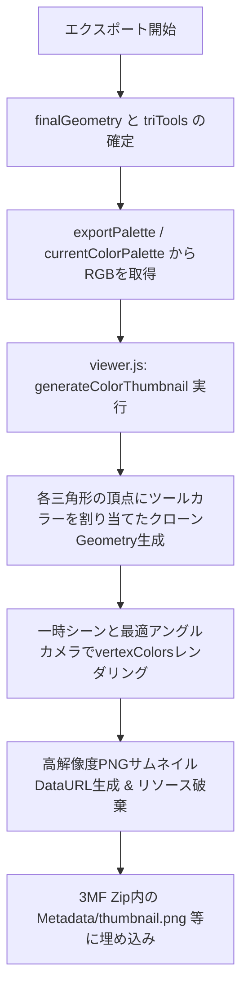

# 3MFマルチカラーエクスポート時のサムネイルカラー化 実装計画

BumpMesh_Colorで出力する3MFファイルの埋め込みサムネイル（Bambu Studio, OrcaSlicer, PrusaSlicer, Windowsエクスプローラー等で表示）を、灰色ではなく設定されたマルチカラー配色（パレット色）で鮮やかに表示されるよう改良します。

## 現状の課題と原因
- 現在の `getViewerThumbnail()` は、画面上のWebGLキャンバスをそのままキャプチャしています。
- エクスポート時、画面上のビューワーは元のグレーのSTLメッシュが表示されていることが多く、マルチカラーに塗り分けられた情報がサムネイルに反映されていませんでした。

## 改良方針

### 1. viewer.js の拡張
- 新関数 `generateColorThumbnail(geometry, triTools, palette, maxDim = 256)` を追加します。
  - **頂点カラーのバインド**:
    - `triTools` 配列（各三角形のtoolId）と `palette`（各toolIdのRGB値）を走査。
    - 各三角形の3頂点に対して、対応するツールのRGB（0.0〜1.0）を格納した `Float32BufferAttribute('color', 3)` を構築。
  - **一時オフスクリーンシーンでの安全なレンダリング**:
    - メインのビューワー表示やユーザーのカメラ操作に影響を与えないよう、一時的な `THREE.Scene` と `THREE.PerspectiveCamera` を構築。
    - モデルのバウンディングスフィアから斜め45度見下ろし（モデル全体が最も美しく立体的に見えるアングル）にカメラを自動配置。
    - キリッとした陰影を出すため、キーライト・フィルライト・環境光を配置。
    - `MeshStandardMaterial({ vertexColors: true, roughness: 0.5, metalness: 0.1 })` を使用。
    - キャンバスにレンダリング後、`toDataURL('image/png')` を取得。
    - 一時作成したマテリアル・ジオメトリ・ライト等を確実に `dispose()` してメモリリークを防止。
  - フォールバックとして、マルチカラー情報がない場合は従来の `getViewerThumbnail()` を呼び出す安全設計。

### 2. main.js の更新
- `exportMultiColor3MF` の呼び出し箇所（レイヤーブレンドモード、通常量子化モード）において：
  - `getViewerThumbnail(256)` の代わりに `generateColorThumbnail(finalGeometry, triTools, exportPalette, 256)` を呼び出します。

## 変更対象ファイル
- `js/viewer.js`: `generateColorThumbnail` 関数の実装とエクスポート
- `js/main.js`: 3MFエクスポート時のサムネイル生成関数呼び出しの更新
- `docs/color_thumbnail_3mf/task.md`: タスク進捗管理
- `docs/color_thumbnail_3mf/implementation_plan.md`: プロジェクト保存用実装計画

## 検証計画
### 自動/スクリプト検証
- テスト用スクリプトを作成し、テストメッシュと擬似ツールパレットを与えて `generateColorThumbnail` が有効なPNGデータURL（ヘッダー `data:image/png;base64,...`）を生成できること、カラーデータが正しく反映されることを検証。
### 実機・スライサー検証
- 生成された3MFファイルを解凍またはスライサー（Bambu Studio / PrusaSlicer）に読み込ませ、設定したパレットカラーでサムネイルが表示されることを確認。
